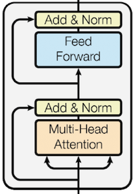
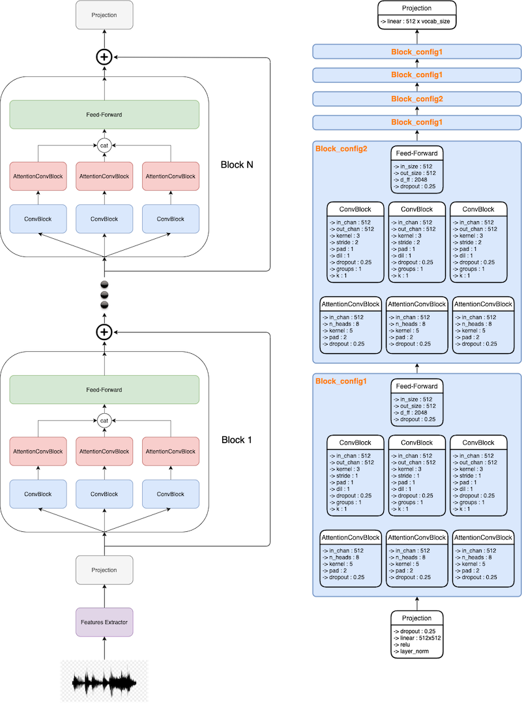

# Speech To Text

Links that I found usefull when working on STT.

## Datasets

* Blog of a list of Voice Datasets -> [9 voice datasets](https://www.cmswire.com/digital-asset-management/9-voice-datasets-you-should-know-about/)
* openSLR dataset -> [LibriSpeech ASR corpus](http://www.openslr.org/12/)
* [VoxForge Dataset](http://www.openslr.org/12/)
* [TensorFlow Speech Recognition Challenge](https://www.kaggle.com/c/tensorflow-speech-recognition-challenge/data)
* [Common Voice corpus](https://voice.mozilla.org/en/datasets)
* [VoxCeleb](http://www.robots.ox.ac.uk/~vgg/data/voxceleb/)

## Preprocessing Data

* Great blog about audio signal preprocessing -> [Speech Processing](https://haythamfayek.com/2016/04/21/speech-processing-for-machine-learning.html)
* Python Library -> [pyfilterbank](http://siggigue.github.io/pyfilterbank/), [Librosa](https://librosa.github.io/librosa/), [SoundFile](https://github.com/bastibe/SoundFile/)
* Kaggle example -> [Speech Recognition Challenge](https://www.kaggle.com/ybonde/log-spectrogram-and-mfcc-filter-bank-example)

## Papers

* [Towards End-to-End Speech Recognition with Reccurent Neural Networks](http://proceedings.mlr.press/v32/graves14.pdf)
* [Deep Speech](https://arxiv.org/pdf/1412.5567.pdf)
* [Deep Speech 2](https://arxiv.org/pdf/1512.02595.pdf)
* [Listen, Attend and Spell](https://arxiv.org/pdf/1508.01211.pdf) (LAS)
* [LAS 2](https://arxiv.org/pdf/1712.01769.pdf)
* [CTC](http://citeseerx.ist.psu.edu/viewdoc/download?doi=10.1.1.75.6306&rep=rep1&type=pdf)
* [Syllable-based Seq2Seq Speech Recognition with Transformers](https://arxiv.org/pdf/1804.10752.pdf)
* [Multilingual End-to-End Speech Recognition with A Single Transformer on Low-Resource Languages](https://arxiv.org/pdf/1806.05059.pdf) 

---

My github repository with some ASR experiments -> [ASR](https://github.com/thbeucher/ML_pytorch/tree/master/apop/ASR)

---

Usual approaches for Automatic Speech Recognition (ASR) use different modules (Acoustic Modeling, Pronunciation Modeling, Language Modeling) trained separately and often hand-designed. 

Seeing deep learning improvement (optimization, data usage) over past years, it is possible to consider and design an End-to-End algorithm to perform ASR. 

Multiple architectures were proposed using Recurrent Neural Network (RNN). Two main way appear, one using Connectionist Temporal Classification (CTC) based models and the other using Sequence-to-Sequence framework with Attention. 

All those approaches use Spectrograms as input features and produce character level outputs. They use Beam search and potential Language Model (LM) to improve scores. 

One major problem for ASR with labeled data is the alignment between the audio sources and the transcripts which is partially handle by CTC based models or by the attention mechanism in Seq-to-Seq framework.  

HMM and CTC models made a strong assumption about frame-independence, Seq2Seq models remove this assumption allowing them to learn an implicit LM and optimize WER more directly. (WER - Word Error Rate is the usual metric used to measure ASR models performance) 

All those approaches are computationally heavy, and the recurrence used made parallelization impracticable.

---

1) Input representation

In the litterature, we usually found the use of Filter Banks or Mel-Frequency Cepstral Coefficients (MFCCs) as input features. They comes from extensive human engineering that aim to simulate how the human ear works.

For my Speech-to-Text(STT) project, I've decided to go on an End-to-End design, even for the input. Learning to perform STT task directly from raw signal is really hard and in the current state of our knowledge on artificial neural network(ANN), it requires too much labeled data. When you think about ourself, even with our advance big neural network designed through evolution, we are exposed to a lot of sound signal and it takes us almost a year to show sign that we understand some simple interaction and 3 years and more to be able to use words. We have leverage some labeled data when our parents repeat the same sound when pointing to a single object but most of our learning seems to be self-supervised.
There is a lot of unlabelled sound data in the web, so maybe we can leverage it to allow our ANN to perform well at the task.

The first technic that came to my mind is Predictive Coding(PC) where the theory is that the brain creates and maintains a model of the environment by predicting the futur and compare its prediction to the reality. So, to creates our features representation in a self-supervised way, we can design an ANN that will first downsample the signal, using a convolutional network for example, to obtain a more compact representation (we can add a sparsity constraint on this representation), then we use another neural network, which can also be a convolutional network (using transposed convolution), to recreates the signal and the loss could be a simple Mean Squared Error(MSE). (One work that I found particularly interesting in this field is [SDPC](https://arxiv.org/pdf/1902.07651.pdf))
The problem is that it will be computationally intensive and you will certainly struggle to fit, in your GPU, a big enough architecture that will have a good performance.

Indeed, the usual sample rate of an audio signal is 44.1Khz. It means that you have 44,100 numerical values to describe each second of your record so even with a 2s audio record you will have an array of shape (88200,). In the case of openSLR dataset, the sample rate choosed is way lower, 16Khz, but it still give you big arrays for even small records.

Another option could be a technic called Contrastive Learning (or Contrastive Predictive Coding).

2) Architecture review

Browsing the literature on Speech-to-Text task, we found various kind of architecture. Let's see some and their pytorch implementation.

The most famous one for the moment in NLP field, the Transformer.



Even if there is now an official implementation in pytorch, I've made at the time my own and I've add option to use the version propose in the paper [Stabilizing Transformers For Reinforcement Learning](https://arxiv.org/pdf/1910.06764.pdf). You can find it [here](https://github.com/thbeucher/ML_pytorch/blob/master/apop/models/transformer/encoder.py).

Taking ideas from papers [han2019](https://arxiv.org/pdf/1910.00716.pdf), [wu2019pay](https://openreview.net/pdf?id=SkVhlh09tX), [kriman2020quartznet](https://arxiv.org/pdf/1910.10261.pdf) and [hannun2019sequence](https://arxiv.org/pdf/1904.02619.pdf) we can creates 4 differents convolution architecture:

* Separable Convolution: (I put it for information but I'm not sure about my implementation as I get fewer parameters as expected but it seems computationally not efficient)
```python
class SeparableConvBlock(nn.Module):
  def __init__(self, in_chan, out_chan, kernel=3, stride=1, pad=1, dil=1, dropout=0., k=1, **kwargs):
    super().__init__()
    assert k in [1, 2], 'Handle only k = 1 or 2'
    self.conv = nn.Sequential(nn.Conv1d(in_chan, k * in_chan, kernel, stride=stride, padding=pad, dilation=dil, groups=in_chan),
                              nn.BatchNorm1d(k * in_chan),
                              nn.ReLU(inplace=True) if k == 1 else nn.GLU(dim=1),
                              nn.Dropout(dropout),
                              nn.Conv1d(k * in_chan, out_chan, 1),
                              nn.BatchNorm1d(out_chan),
                              nn.ReLU(inplace=True),
                              nn.Dropout(dropout))
  
  def forward(self, x):  # [batch_size, in_chan, seq_len]
    return self.conv(x)  # [batch_size, out_chan, seq_len]
```

* Basic convolutional block:
```python
class ConvBlock(nn.Module):
  def __init__(self, in_chan, out_chan, kernel=3, stride=1, pad=1, dil=1, dropout=0., groups=1, k=1, **kwargs):
    super().__init__()
    assert k in [1, 2], 'Handle only k = 1 or 2'
    self.conv = nn.Sequential(nn.Conv1d(in_chan, out_chan, kernel, stride=stride, padding=pad, dilation=dil, groups=groups),
                              nn.BatchNorm1d(out_chan),
                              nn.ReLU(inplace=True) if k == 1 else nn.GLU(dim=1),
                              nn.Dropout(dropout))
  
  def forward(self, x):  # [batch_size, in_chan, seq_len]
    return self.conv(x)  # [batch_size, out_chan, seq_len] or [batch_size, out_chan // 2, seq_len] if k == 2
```

* Convolution attention from [Lightconv](https://openreview.net/pdf?id=SkVhlh09tX):
```python
class AttentionConvBlock(nn.Module):
  def __init__(self, in_chan, n_heads=8, kernel=5, dropout=0., pad=2, bias=True, **kwargs):
    super().__init__()
    assert in_chan // n_heads * n_heads == in_chan, 'in_chan must be evenly divisible by n_heads'
    self.n_heads = n_heads
    self.dropout = dropout
    self.pad = pad
    self.bias = None

    self.weight = nn.Parameter(torch.Tensor(n_heads, 1, kernel))
    nn.init.xavier_uniform_(self.weight)

    if bias:
      self.bias = nn.Parameter(torch.Tensor(in_chan))
      nn.init.constant_(self.bias, 0.)
  
  def forward(self, x):  # [batch_size, in_chan, seq_len]
    in_ = x.reshape(-1, self.n_heads, x.size(2))
    weight = F.dropout(F.softmax(self.weight, dim=-1), self.dropout, training=self.training)
    out = F.conv1d(in_, weight, padding=self.pad, groups=self.n_heads).reshape(x.shape)

    if self.bias is not None:
      out = out + self.bias.view(1, -1, 1)
    return out
```

* Combination of a ConvBlock and an AttentionConvBlock:
```python
class ConvAttentionConvBlock(nn.Module):
  def __init__(self, in_chan, out_chan, kernel_conv=3, stride_conv=1, pad_conv=1, dil_conv=1, dropout_conv=0., groups=1, k=1,
               n_heads=8, kernel_attn=5, dropout_attn=0., pad_attn=2, bias=True):
    super().__init__()
    self.conv = ConvBlock(in_chan, out_chan, kernel=kernel_conv, stride=stride_conv, pad=pad_conv, dil=dil_conv, dropout=dropout_conv,
                          groups=groups, k=k)
    self.attn_conv = AttentionConvBlock(out_chan//k, n_heads=n_heads, kernel=kernel_attn, dropout=dropout_attn, pad=pad_attn, bias=bias)
  
  def forward(self, x):  # [batch_size, in_chan, seq_len]
    return self.attn_conv(self.conv(x))
```

We can also add a simple feed-forward network:
```python
class FeedForward(nn.Module):
  def __init__(self, input_size, output_size, d_ff=2048, dropout=0., **kwargs):
    super().__init__()
    self.ff = nn.Sequential(nn.Linear(input_size, d_ff),
                            nn.ReLU(inplace=True),
                            nn.Dropout(dropout),
                            nn.Linear(d_ff, output_size),
                            nn.Dropout(dropout),
                            nn.LayerNorm(output_size))
  
  def forward(self, x):  # [batch_size, *, input_size]
    return self.ff(x)   # [batch_size, *, output_size]
```

Now with these building blocks, we can create our network:



where the features extractor is [wav2vec](https://arxiv.org/abs/1904.05862), the input projection and final projection are simple linears.

The model is made of multiple layers with multiple blocks, to allow multiple configurations using the same class model, we can design our class to be block/layer agnostic.

```python
class STTModel(nn.Module):
  def __init__(self, config=None, residual=True, output_size=None, input_proj=None, wav2vec_frontend=True, **kwargs):
    super().__init__()
    self.config = config
    self.output_proj = None
    ## list all authorized blocks
    self.available_blocks = {'conv_block': ConvBlock, 'attention_conv_block': AttentionConvBlock, 'feed_forward': FeedForward}
    
    ## retrieve features extractor
    self.wav2vec = get_wav2vec_model() if wav2vec_frontend else None
    
    ## retrieve projection layer if desired
    self.input_proj = get_input_proj_layer(config=input_proj)  # will return None if input_proj is None
    
    ## retrieve default config if not given
    if config is None:
      self.config = get_stt_model_config(config='base')
    
    ## define the network
    layers = []
    for layer in self.config:
      blocks = []
      for block in layer:
        sub_blocks = []
        for parallel_sub_block_type, block_config in block:
          sub_blocks.append(self.available_blocks[parallel_sub_block_type](**block_config))
        blocks.append(nn.ModuleList(sub_blocks))
      layers.append(nn.ModuleList(blocks))
    self.network = nn.ModuleList(layers)
    
    ## create the output projection if desired
    if output_size is not None:
      key = [k for k in ['output_size'] if k in self.config[-1][-1][-1][1]][0]
      self.output_proj = nn.Linear(self.config[-1][-1][-1][1][key], output_size)
    
  @torch.no_grad()
  def _wav2vec_forward(self, x):  # x = [batch_size, signal_len]
    z = self.wav2vec.feature_extractor(x)  # n_feats = 512
    c = self.wav2vec.feature_aggregator(z)  # [batch_size, n_feats, seq_len]
    return c.permute(0, 2, 1)  # [batch_size, seq_len, n_feats]
    
  def forward(self, x, y=None):
    if self.wav2vec is not None:
      x = self._wav2vec_forward(x)
    
    if self.input_proj is not None:
      x = self.input_proj(x)
    
    for i, layer in enumerate(self.network):
      out = x
      for j, block in enumerate(layer):
        outs = []
        for k, sub_block in enumerate(block):
          if 'conv' in self.config[i][j][k][0]:
            outs.append(sub_block(out.permute(0, 2, 1)).permute(0, 2, 1))
          else:
            outs.append(sub_block(out))
        out = torch.cat(outs, dim=-1)
      x = x + out if self.residual and out.shape == x.shape else out
    
    if self.output_proj is not None:
      x = self.output_proj(x)
    return x
```

where **get_wav2vec_model**, **get_input_proj_layer** and **get_stt_model_config** functions are defined as follow : 

```python
from fairseq.models.wav2vec import Wav2VecModel

def get_wav2vec_model(filename='wav2vec_large.pt', eval_model=True):
  checkpoint = torch.load(filename)
  wav2vec_model = Wav2VecModel.build_model(checkpoint['args'], task=None)
  wav2vec_model.load_state_dict(checkpoint['model'])
  
  if eval_model:
    wav2vec_model.eval()
  
  return wav2vec_model

def get_input_proj_layer(config='base'):
  if config == 'base':
    input_proj = nn.Sequential(nn.Dropout(0.25), nn.Linear(512, 512), nn.ReLU(inplace=True), nn.LayerNorm(512))
  else:
    input_proj = None
  return input_proj


def get_stt_model_config(config='base'):
  if config == 'whatever':
    raise NotImplementedError
  else:
    cnet_config = [
                    [
                      [
                        ('conv_attention_conv_block', {'in_chan': 512, 'out_chan': 512, 'kernel_conv': 3, 'stride_conv': 1, 'pad_conv': 1,
                                                       'dil_conv': 1, 'dropout_conv': 0.25, 'groups': 1, 'k': 1, 'n_heads': 8,
                                                       'kernel_attn': 5, 'dropout_attn': 0.25, 'pad_attn': 2, 'bias': True}),
                        ('conv_attention_conv_block', {'in_chan': 512, 'out_chan': 512, 'kernel_conv': 3, 'stride_conv': 1, 'pad_conv': 2,
                                                       'dil_conv': 2, 'dropout_conv': 0.25, 'groups': 1, 'k': 1, 'n_heads': 8,
                                                       'kernel_attn': 5, 'dropout_attn': 0.25, 'pad_attn': 2, 'bias': True}),
                        ('conv_attention_conv_block', {'in_chan': 512, 'out_chan': 512, 'kernel_conv': 3, 'stride_conv': 1, 'pad_conv': 3,
                                                       'dil_conv': 3, 'dropout_conv': 0.25, 'groups': 1, 'k': 1, 'n_heads': 8,
                                                       'kernel_attn': 5, 'dropout_attn': 0.25, 'pad_attn': 2, 'bias': True})
                      ],
                      [('feed_forward', {'input_size': 3 * 512, 'output_size': 512, 'd_ff': 2048, 'dropout': 0.25})]
                    ],
                    [
                      [
                        ('conv_attention_conv_block', {'in_chan': 512, 'out_chan': 512, 'kernel_conv': 3, 'stride_conv': 2, 'pad_conv': 1,
                                                       'dil_conv': 1, 'dropout_conv': 0.25, 'groups': 1, 'k': 1, 'n_heads': 8,
                                                       'kernel_attn': 5, 'dropout_attn': 0.25, 'pad_attn': 2, 'bias': True}),
                        ('conv_attention_conv_block', {'in_chan': 512, 'out_chan': 512, 'kernel_conv': 3, 'stride_conv': 2, 'pad_conv': 2,
                                                       'dil_conv': 2, 'dropout_conv': 0.25, 'groups': 1, 'k': 1, 'n_heads': 8,
                                                       'kernel_attn': 5, 'dropout_attn': 0.25, 'pad_attn': 2, 'bias': True}),
                        ('conv_attention_conv_block', {'in_chan': 512, 'out_chan': 512, 'kernel_conv': 3, 'stride_conv': 2, 'pad_conv': 3,
                                                       'dil_conv': 3, 'dropout_conv': 0.25, 'groups': 1, 'k': 1, 'n_heads': 8,
                                                       'kernel_attn': 5, 'dropout_attn': 0.25, 'pad_attn': 2, 'bias': True})
                      ],
                      [('feed_forward', {'input_size': 3 * 512, 'output_size': 512, 'd_ff': 2048, 'dropout': 0.25})]
                    ],
                    [
                      [
                        ('conv_attention_conv_block', {'in_chan': 512, 'out_chan': 512, 'kernel_conv': 3, 'stride_conv': 1, 'pad_conv': 1,
                                                       'dil_conv': 1, 'dropout_conv': 0.25, 'groups': 1, 'k': 1, 'n_heads': 8,
                                                       'kernel_attn': 5, 'dropout_attn': 0.25, 'pad_attn': 2, 'bias': True}),
                        ('conv_attention_conv_block', {'in_chan': 512, 'out_chan': 512, 'kernel_conv': 3, 'stride_conv': 1, 'pad_conv': 2,
                                                       'dil_conv': 2, 'dropout_conv': 0.25, 'groups': 1, 'k': 1, 'n_heads': 8,
                                                       'kernel_attn': 5, 'dropout_attn': 0.25, 'pad_attn': 2, 'bias': True}),
                        ('conv_attention_conv_block', {'in_chan': 512, 'out_chan': 512, 'kernel_conv': 3, 'stride_conv': 1, 'pad_conv': 3,
                                                       'dil_conv': 3, 'dropout_conv': 0.25, 'groups': 1, 'k': 1, 'n_heads': 8,
                                                       'kernel_attn': 5, 'dropout_attn': 0.25, 'pad_attn': 2, 'bias': True})
                      ],
                      [('feed_forward', {'input_size': 3 * 512, 'output_size': 512, 'd_ff': 2048, 'dropout': 0.25})]
                    ],
                    [
                      [
                        ('conv_attention_conv_block', {'in_chan': 512, 'out_chan': 512, 'kernel_conv': 3, 'stride_conv': 2, 'pad_conv': 1,
                                                       'dil_conv': 1, 'dropout_conv': 0.25, 'groups': 1, 'k': 1, 'n_heads': 8,
                                                       'kernel_attn': 5, 'dropout_attn': 0.25, 'pad_attn': 2, 'bias': True}),
                        ('conv_attention_conv_block', {'in_chan': 512, 'out_chan': 512, 'kernel_conv': 3, 'stride_conv': 2, 'pad_conv': 2,
                                                       'dil_conv': 2, 'dropout_conv': 0.25, 'groups': 1, 'k': 1, 'n_heads': 8,
                                                       'kernel_attn': 5, 'dropout_attn': 0.25, 'pad_attn': 2, 'bias': True}),
                        ('conv_attention_conv_block', {'in_chan': 512, 'out_chan': 512, 'kernel_conv': 3, 'stride_conv': 2, 'pad_conv': 3,
                                                       'dil_conv': 3, 'dropout_conv': 0.25, 'groups': 1, 'k': 1, 'n_heads': 8,
                                                       'kernel_attn': 5, 'dropout_attn': 0.25, 'pad_attn': 2, 'bias': True})
                      ],
                      [('feed_forward', {'input_size': 3 * 512, 'output_size': 512, 'd_ff': 2048, 'dropout': 0.25})]
                    ],
                    [
                      [
                        ('conv_attention_conv_block', {'in_chan': 512, 'out_chan': 512, 'kernel_conv': 3, 'stride_conv': 1, 'pad_conv': 1,
                                                       'dil_conv': 1, 'dropout_conv': 0.25, 'groups': 1, 'k': 1, 'n_heads': 8,
                                                       'kernel_attn': 5, 'dropout_attn': 0.25, 'pad_attn': 2, 'bias': True}),
                        ('conv_attention_conv_block', {'in_chan': 512, 'out_chan': 512, 'kernel_conv': 3, 'stride_conv': 1, 'pad_conv': 2,
                                                       'dil_conv': 2, 'dropout_conv': 0.25, 'groups': 1, 'k': 1, 'n_heads': 8,
                                                       'kernel_attn': 5, 'dropout_attn': 0.25, 'pad_attn': 2, 'bias': True}),
                        ('conv_attention_conv_block', {'in_chan': 512, 'out_chan': 512, 'kernel_conv': 3, 'stride_conv': 1, 'pad_conv': 3,
                                                       'dil_conv': 3, 'dropout_conv': 0.25, 'groups': 1, 'k': 1, 'n_heads': 8,
                                                       'kernel_attn': 5, 'dropout_attn': 0.25, 'pad_attn': 2, 'bias': True})
                      ],
                      [('feed_forward', {'input_size': 3 * 512, 'output_size': 512, 'd_ff': 2048, 'dropout': 0.25})]
                    ],
                    [
                      [
                        ('conv_attention_conv_block', {'in_chan': 512, 'out_chan': 512, 'kernel_conv': 3, 'stride_conv': 1, 'pad_conv': 1,
                                                       'dil_conv': 1, 'dropout_conv': 0.25, 'groups': 1, 'k': 1, 'n_heads': 8,
                                                       'kernel_attn': 5, 'dropout_attn': 0.25, 'pad_attn': 2, 'bias': True}),
                        ('conv_attention_conv_block', {'in_chan': 512, 'out_chan': 512, 'kernel_conv': 3, 'stride_conv': 1, 'pad_conv': 2,
                                                       'dil_conv': 2, 'dropout_conv': 0.25, 'groups': 1, 'k': 1, 'n_heads': 8,
                                                       'kernel_attn': 5, 'dropout_attn': 0.25, 'pad_attn': 2, 'bias': True}),
                        ('conv_attention_conv_block', {'in_chan': 512, 'out_chan': 512, 'kernel_conv': 3, 'stride_conv': 1, 'pad_conv': 3,
                                                       'dil_conv': 3, 'dropout_conv': 0.25, 'groups': 1, 'k': 1, 'n_heads': 8,
                                                       'kernel_attn': 5, 'dropout_attn': 0.25, 'pad_attn': 2, 'bias': True})
                      ],
                      [('feed_forward', {'input_size': 3 * 512, 'output_size': 512, 'd_ff': 2048, 'dropout': 0.25})]
                    ]
                  ]
  return cnet_config
```

After our model, to use the [DataLoader](https://pytorch.org/docs/stable/data.html?highlight=dataloader#torch.utils.data.DataLoader) from pytorch we have to define our custom dataset class and the associated collator : 

```python
from torch.utils.data import Dataset

class CustomDataset(Dataset):
  def __init__(self):
    pass
  
  def __len__(self):
    pass
  
  def __getitem__(self, idx):
    pass

class CustomCollator(object):
  def __init__(self):
    pass
  
  def __call__(self, batch):
    pass
```

Now we can define a class that will handle the training, evaluation and everything else that we want : 

```python
class CTCTrainer(object):
  def __init__(self):
    pass
  
  def set_metadata(self):
    pass
  
  def set_data_loader(self):
    pass
  
  def instanciate_model(self):
    pass
  
  def train(self):
    pass
  
  def train_pass(self):
    pass
  
  @torch.no_grad():
  def evaluation(self):
    pass
```

3) Possible losses

* ASG & CTC -> [ASG-CTC](https://towardsdatascience.com/better-faster-speech-recognition-with-wav2letters-auto-segmentation-criterion-765efd55449), [CTC](https://distill.pub/2017/ctc/), [CTC paper](https://www.cs.toronto.edu/~graves/icml_2006.pdf)
* Cross-Entropy in the case where alignment is handle by using attention mechanism

4) Training

5) Evaluation

---
Site Map:
* Main page -> *[Main](index.md)*
* Transformer post -> *[Transformer](transformer.md)*
* Neural Plasticity post -> *[Neural Plasticity](plasticity.md)*
* Curriculum Vitae -> [CV](cv.md)
* Contact page -> *[Contact](contact.md)*
