# Spiking Neural Network and Image Classification
In this blog post we will see in detail (language/visual/code informations)
how to implement in python a Spiking Neural Network (SNN) that perform image classification using unsupervised learning algorithm
(Spike-Timing Dependent Plasticity) and supervised one (R-STDP).

## Introduction
What SNN is? STDP? R-STDP?

The proposed experiment correspond to the one described in ([Mozafari et al.](https://ieeexplore.ieee.org/document/8356226/)) and implemented by the author [here](https://github.com/miladmozafari/SpykeTorch/blob/master/MozafariShallow.py).
I will use the code from the [SpykeTorch](https://cnrl.ut.ac.ir/SpykeTorch/doc/index.html) library that I will restructure and modify when needed.

So we will use the [MNIST](http://yann.lecun.com/exdb/mnist/) dataset to show how we can perform Image Classification using SNN and STDP/R-STDP.

Overview schema : 

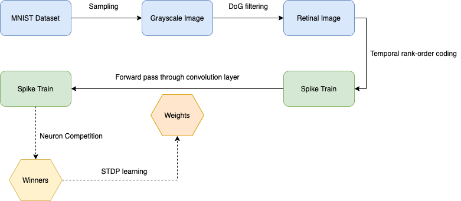

Content:

1. Image transformation using a simple retinal model
2. Temporal transformation using rank-order coding scheme
3. Spiking Deep Convolutional Network Learning using STDP and R-STDP
    1. Neural architecture / Neuron model
    2. Neuron competition / Winners election
    3. STDP and R-STDP learning
4. Hyperparameters
5. Packing everything / Training & Testing script
6. Visualization

## Image Transformation using a simple retinal model
We use Difference of Gaussian ([DoG](https://en.wikipedia.org/wiki/Difference_of_Gaussians)) filtering as our retinal model. It well approximates the center-surround property of the Retinal Ganglion Cells (RGC).

So the detection of positive or negative contrasts done by respectively ON-center and OFF-center RGC will be modelled by two DoG kernels. Our filter will correspond to the application of these kernels to an image using convolution operation.

To implement our filter we will first create a function ```construct_DoG_kernel``` and a class ```DoGKernel``` :

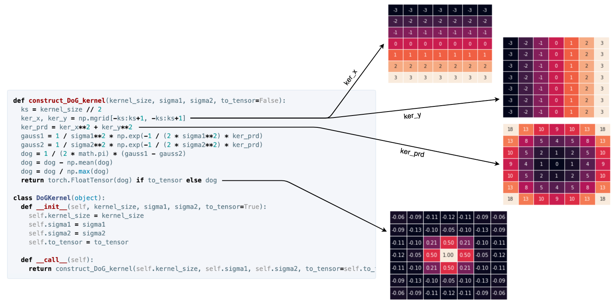

The plots are created with ```kernel_size=1, sigma1=1, sigma2=2``` and using a line of code like this one :
```python
sns.heatmap(dog, linewidths=.5, annot=True, fmt='.2f', cbar=False, xticklabels=False, yticklabels=False)
```
Now we can create our class ```Filter``` : 
```python
class Filter(object):
  def __init__(self, configuration):
    base_configuration = {'kernel_type': DoGKernel,
                          'kernels_conf': [[7, 1, 2], [7, 2, 1]],
                          'padding': 3,
                          'threshold': 50, 'use_threshold': True}
    self.configuration = {**base_configuration, **configuration}
    # creates kernels and pad smaller kernels to fit biggest one
    self.max_kernel_size = max([conf[0] for conf in self.configuration['kernels_conf']])
    
    kernels = []
    for conf in self.configuration['kernels_conf']:
      # kernel shape = (1, kernel_size, kernel_size)
      kernel = self.configuration['kernel_type'](*conf)().unsqueeze(0)
      pad = (self.max_kernel_size - conf[0]) // 2
      kernels.append(torch.nn.functional.pad(kernel, (pad, pad, pad, pad)))
    
    # self.kernels shape = (n_kernels, 1, kernel_size, kernel_size) 
    self.kernels = torch.stack(kernels)
  
  def __call__(self, x):  # x = (1, 1, height, width)
    out = torch.nn.functional.conv2d(x, self.kernels, padding=self.configuration['padding'])
    
    if self.configuration['use_threshold']:
      out = torch.where(out < self.configuration['threshold'], torch.zeros(1), out)
    return out
```
As you see, we add an option to allow the DoG cells to output their values only if their activations are above a certain threshold. It will clean the image by removing noise and keep only the most important informations as you can see in the example below on an astronaut image : 

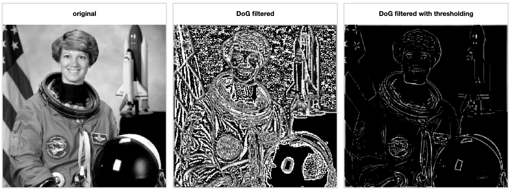

The above plot is generated on a jupyter notebook using the following code : 

<details>
<summary><strong>Click to expand!</strong></summary>
<p>

```python
%matplotlib inline
import torch
import ipyplot
import torchvision.transforms as transforms

from PIL import Image
from skimage import data

img_arr = data.astronaut()
gray_img_arr = transforms.functional.rgb_to_grayscale(torch.from_numpy(img_arr).permute(2, 0, 1))
gray_img = Image.fromarray(gray_img_arr.squeeze(0).numpy().astype(np.uint8), mode='L')

# Filter is the class implemented above
filters = Filter({'kernels_conf': [[7, 1, 2]], 'padding': 3, 'use_threshold': False})
filters_threshold = Filter({'kernels_conf': [[7, 1, 2]], 'padding': 3})

gray_img_filtered = filters(gray_img_arr.float().unsqueeze(0))
gray_img_filtered_threshold = filters_threshold(gray_img_arr.float().unsqueeze(0))

img_filtered = Image.fromarray(gray_img_filtered.squeeze(0).squeeze(0).numpy().astype(np.uint8), mode='L')
img_filtered_threshold = Image.fromarray(gray_img_filtered_threshold.squeeze(0).squeeze(0).numpy().astype(np.uint8), mode='L')
ipyplot.plot_images([gray_img, img_filtered, img_filtered_threshold], ['original', 'DoG filtered', 'DoG filtered with thresholding'], max_images=3, img_width=300)
```

</p>
</details>

Now that we are able to mimic our retinal ganglion cells and obtain a contrast level information, we can apply the choosen neural coding scheme.

Here a schema that resume and visualize what we have done in this first step : 

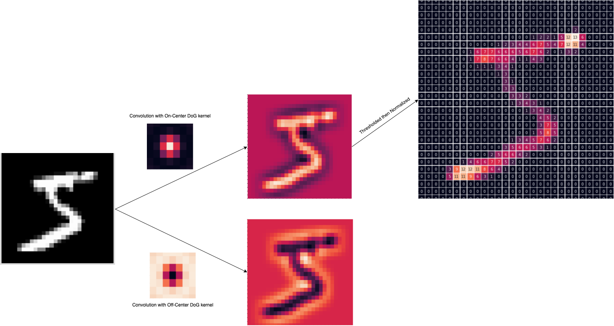

## Temporal transformation using rank-order coding scheme
Now we want to convert contrast informations into spikes where the DoG cells, [retinotopically arranged](https://medical-dictionary.thefreedictionary.com/retinotopic+map), that are the most activated (ie highest contrast) will fire first. This simple scheme have demonstrate ([Rullen and Thorpe](https://www.researchgate.net/publication/11952248_Rate_Coding_Versus_Temporal_Order_Coding_What_the_Retinal_Ganglion_Cells_Tell_the_Visual_Cortex)) efficient information transmission and it's computationally very simple.

We will add to our 3-D tensor ```(n_DoG_kernels, image_height, image_width)``` a fourth dimension that correspond to time.
But before that I have to add some context to explain how we will perform our temporal transformation.

In this experiment we use the biological neuron model called [Perfect Integrate-and-fire](https://en.wikipedia.org/wiki/Biological_neuron_model#Leaky_integrate-and-fire)
that simply accumulates input spikes from presynaptic neurons and emit a spike if the membrane potential reach a specific threshold.

Moreover, to mimic the visual cortex organization of the brain, we organize the neurons in a retinopically way using convolution operation and shared sets of synaptic weights as each formed map should detect the same visual feature but at different locations.

So a naive implementation could be to process timestep by timestep and keeping in memory the accumulate potential value of every neuron membrane to be able to know when each neuron emit or not a spike. But it's possible to obtain the output train spikes doing only one 2-D convolution computation by create our input spikes in an accumulative manner.

Let's create our ```cumulative_intensity_to_latency``` function that will operate this transformation : 

```python
def cumulative_intensity_to_latency(intensities, n_time_steps, to_spike=True):
  # bin size to get all non-zero intensities into the n_time_steps defined
  bin_size = torch.count_nonzero(intensities) // n_time_steps

  # flattening intensities then sort it
  intensities_flattened_sorted = torch.sort(intensities.view(-1), descending=True)

  # split intensities into n_time_steps bins
  sorted_bins_value = torch.split(intensities_flattened_sorted[0], bin_size)
  sorted_bins_idx = torch.split(intensities_flattened_sorted[1], bin_size)
  
  spike_map = torch.zeros(intensities_flattened_sorted[0].shape)
  
  # create spikes map step by step in a cumulative manner
  # ie when a neuron emite a spike, we propagate it to all next timesteps
  bins_intensities = []
  for i in range(n_time_steps):
    spike_map.scatter_(0, sorted_bins_idx[i], sorted_bins_value[i])  # cumulative line
    bins_intensities.append(spike_map.clone().reshape(intensities.shape[1:]))
  
  # shape = (n_timesteps, n_filters, height, width)
  out = torch.stack(bins_intensities)
  return out.sign() if to_spike else out
```
Let's try to visualize this transformation using a fake example : 

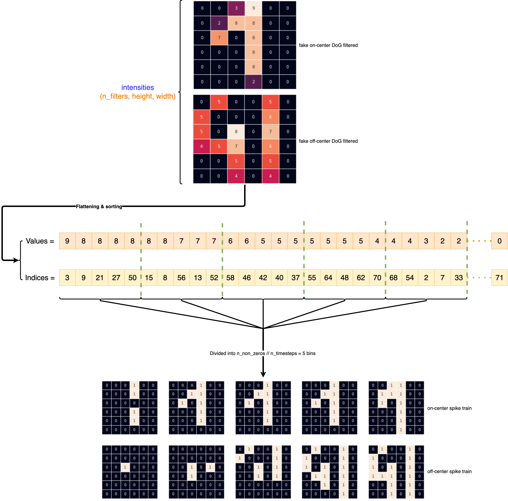

And what this transformation on MNIST data look like : 

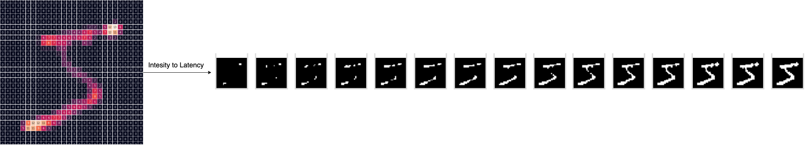

Now that we have our inputs as spike trains we can define our network and how the learning is performed.

## Spiking Deep Convolutional Network Learning using STDP and R-STDP

In this experiment we use the architecture from ([Mozafari et Al](https://arxiv.org/abs/1804.00227)) depicted in the following schema : 

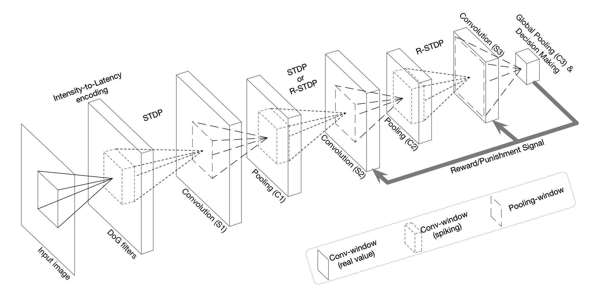

We have 3 convolution layers and 3 pooling layers. Only the convolution layers are trainable, they are composed of non-leaky integrate-and-fire neurons retinotopically organized.

Our neuron model can be seen like this : 

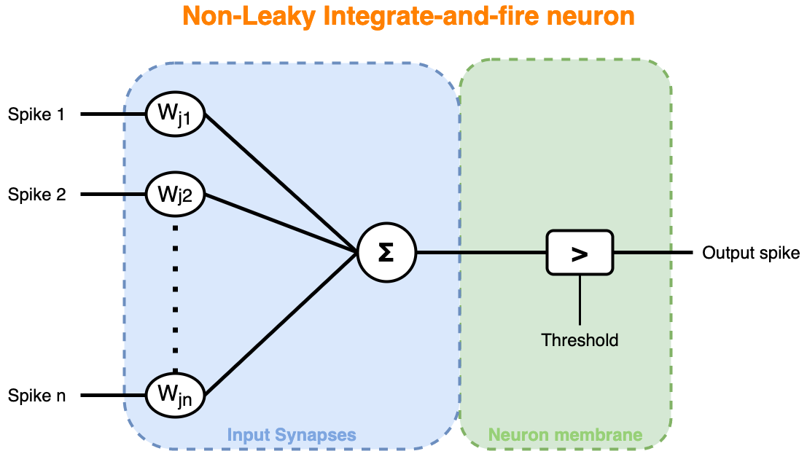

where the input spikes going through each synapses are pondered by their respective efficacity (synapses weights) then the accumulated potential (sum) will make the neuron to fire or not depending on its membrane sensibility (threshold).

So our layer can be depicted by two operation : 
* convolution
* thresholding (firing)

To be able to detect a certain amount of visual features regardless of its location, we create a sets of synapses weights (convolution kernel/feature map) that we will train using STDP or R-STDP.

We can now implement our convolutional layer the following way : 
```python
class Convolution(nn.Module):
  def __init__(self, in_channels, out_channels, kernel_size, stride=1, padding=0, dilation=1, groups=1, bias=None,
               weight_mean=0.8, weight_std=0.02, *args, **kwargs):
    super().__init__()
    self.in_channels = in_channels
    self.out_channels = out_channels
    self.kernel_size = kernel_size if isinstance(kernel_size, tuple) else (kernel_size, kernel_size)
    self.stride = stride
    self.padding = padding
    self.dilation = dilation
    self.groups = groups
    self.bias = bias

    self.weights = nn.Parameter(torch.Tensor(out_channels, in_channels, *self.kernel_size), requires_grad=False)
    self._reset_weights(weight_mean=weight_mean, weight_std=weight_std)
  
  def forward(self, x, padding=None):
    return nn.functional.conv2d(x, self.weights, bias=self.bias, stride=self.stride,
                                padding=self.padding if padding is None else padding,
                                dilation=self.dilation, groups=self.groups)
```
And our ```fire``` function : 
```python
def fire(potentials, threshold=None, return_thresholded_potentials=False):
  thresholded = potentials.clone()
  if threshold is None:
    thresholded[:-1]=0
  else:
    torch.nn.functional.threshold_(thresholded, threshold, 0)
  return (thresholded.sign(), thresholded) if return_thresholded_potentials else thresholded.sign()
```
Now to train the first two layer of our network, we will use [STDP](https://en.wikipedia.org/wiki/Spike-timing-dependent_plasticity) process. This process will adjust the synaptic strengths based on relative timing between post-synaptic and pre-synaptic spikes. So it performs two type of action : 
* [long-term potentiation](https://en.wikipedia.org/wiki/Long-term_potentiation) (LTP)
* [long-term depression](https://en.wikipedia.org/wiki/Long-term_depression) (LTD)

LTP will occur if the neuron emit a spike right after being stimulated, otherwise it will be LTD. Concretely, a simplified version of [STDP](http://www.scholarpedia.org/article/Spike-timing_dependent_plasticity) to update the weight is : 

 0$ or neuron j never fires}\\ \end{cases}" />

where i and j represent respectively indices of post- and pre-synaptic neurons, **a<sup>+</sup>** and **a<sup>-</sup>** are the learning rate for LTP & LTD and the term  correspond to a soft bound that maintain the weights between 0 and 1. This equation just say that we will increase the weight if the pre-synaptic neuron emite a spike before the post-synaptic one or decrease it otherwise.

Now that we have our update rule, we need to introduce competition mechanisms in order to allow the learning of different visual features.
We use a variant of [Winners-take-all](https://en.wikipedia.org/wiki/Winner-take-all_(computing)) competition where k neurons will be eligible for a STDP update. As each neuron of a feature map share the same synaptic weights, only the first firing neuron of a map will be choosed. The k winners will be choosed based on the first that emit a spike then the ones with the highest potentials. Moreover, when elected, the neuron will inhibit neighbourg neurons of other maps, preventing them to be selected as the next winners.

Our training graph could be depicted as : 

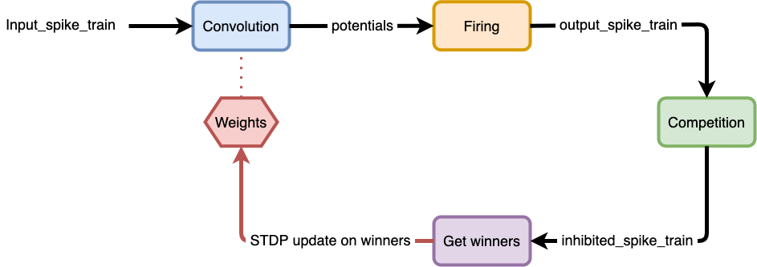

So we define 4 functions : 
* ```pointwise_feature_competition_inhibition```
* ```get_k_winners```
* ```get_pre_post_ordering```
* ```functional_stdp```

The ```pointwise_feature_competition_inhibition``` will find for each position the winning neuron that will inhibit every other neurons in other feature maps : 
```python
def pointwise_feature_competition_inhibition(potentials):
  pot_max = potentials.max(dim=1, keepdim=True)  # max returns (values, indices)
  # use topk instead of max as since torch version 1.0.0, max doesn't return first index when equal max values
  earliest_spikes = pot_max[0].sign().topk(1, dim=0)  # topk returns (values, indices)
  winners = pot_max[1].gather(0, earliest_spikes[1])  # keep values of only winning neurons
  coefs = torch.zeros_like(potentials[0]).unsqueeze_(0).scatter_(1, winners, earliest_spikes[0])  # inhibition coefs
  return torch.mul(potentials, coefs)  # broadcast on each timesteps
```
The ```get_k_winners``` will sort every neurons based on the earliest spike times then their accumulated potentials if needed. Then it will loop over those activated neurons in order to find at most k winners. When a winner is found, first it will set all other neurons in the same feature map to zero then it will inhibit, using a specified inhibition window centered on this neuron, the neurons on other feature maps : 
```python
def get_k_winners(potentials, kwta=1, inhibition_radius=0, spikes=None):
  if spikes is None:
    spikes = potentials.sign()
  # finding earliest potentials for each position in each feature
  # use topk instead of max as since torch version 1.0, max doesn't return first index when equal max values
  maximum = torch.topk(spikes, 1, dim=0)  # [1, feat_out(eg32), height, width]
  values = potentials.gather(dim=0, index=maximum[1]) # gathering values
  # propagating the earliest potential through the whole timesteps
  truncated_pot = spikes * values  # [timestep, feat_out, height, width]
  # summation with a high enough value (maximum of potential summation over timesteps) at spike positions
  v = truncated_pot.max() * potentials.size(0)
  truncated_pot.addcmul_(spikes,v)  # truncated_pot + v * spikes
  # summation over all timesteps
  total = truncated_pot.sum(dim=0,keepdim=True)  # [1, feat_out, height, width]
  
  total.squeeze_(0)
  global_pooling_size = tuple(total.size())
  winners = []
  for k in range(kwta):
    max_val, max_idx = total.view(-1).max(0)
    if max_val.item() != 0:
      # finding the 3d position of the maximum value
      max_idx_unraveled = np.unravel_index(max_idx.item(), global_pooling_size)
      # adding to the winners list
      winners.append(max_idx_unraveled)
      # preventing the same feature to be the next winner
      total[max_idx_unraveled[0],:,:] = 0
      # columnar inhibition (increasing the chance of learning diverse features)
      if inhibition_radius != 0:
        rowMin,rowMax = max(0,max_idx_unraveled[-2]-inhibition_radius),min(total.size(-2),max_idx_unraveled[-2]+inhibition_radius+1)
        colMin,colMax = max(0,max_idx_unraveled[-1]-inhibition_radius),min(total.size(-1),max_idx_unraveled[-1]+inhibition_radius+1)
        total[:,rowMin:rowMax,colMin:colMax] = 0
    else:
      break
  return winners  # winner = (feature, row, column) e.g. (2, 21, 10)
```
Now that we have the neurons that will perform the STDP update we need to know for each one if they have emit a spike before or after received ones from input synapses : 
```python
def get_pre_post_ordering(input_spikes, output_spikes, winners, kernel_size):
  # accumulating input and output spikes to get latencies
  input_latencies = torch.sum(input_spikes, dim=0)  # [feat_in, height_pad, width_pad]
  output_latencies = torch.sum(output_spikes, dim=0)  # [feat_out, height, width]

  result = []
  for winner in winners:
    # generating repeated output tensor with the same size of the receptive field
    out_tensor = torch.ones(*kernel_size, device=output_latencies.device) * output_latencies[winner]
    # slicing input tensor with the same size of the receptive field centered around winner
    # since input_latencies is padded and winners are computes on unpadded input we do not need to shift it to the center
    in_tensor = input_latencies[:, winner[-2]:winner[-2] + kernel_size[-2], winner[-1]:winner[-1] + kernel_size[-1]]
    result.append(torch.ge(in_tensor, out_tensor))  # ge = in_tensor >= out_tensor

  return result  # results_1 shape = [feat_in, kernel_size, kernel_size]
```
Now we have all information in order to update the layer weights : 
```python
def functional_stdp(conv_layer, learning_rate, input_spikes, output_spikes, winners,
                    use_stabilizer=True, lower_bound=0, upper_bound=1):
  pairings = get_pre_post_ordering(input_spikes, output_spikes, winners, conv_layer.kernel_size)
  
  lr = torch.zeros_like(conv_layer.weights)
  for i in range(len(winners)):
    feat = winners[i][0]
    lr[feat] = torch.where(pairings[i], *(learning_rate[feat]))

  conv_layer.weights += lr * ((conv_layer.weights - lower_bound) * (upper_bound - conv_layer.weights) if use_stabilizer else 1)
  conv_layer.weights.clamp_(lower_bound, upper_bound)
```
Let's visualize the STDP update on our fake example spike train : 

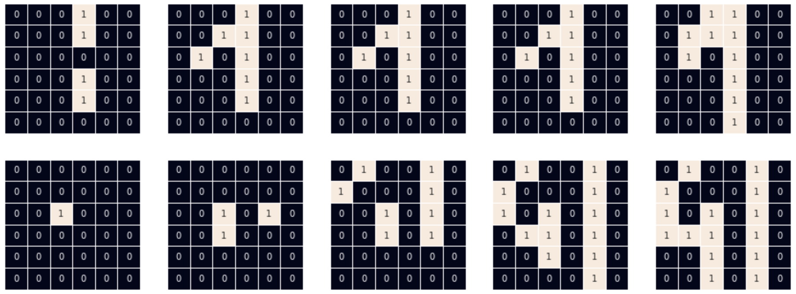

We use our ```Convolution``` class to obtain a random kernel of shape ```(3, 2, 3, 3)``` : 

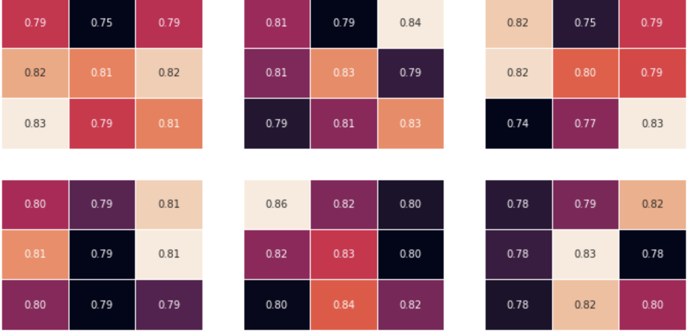

we use this kernel to perform the convolution with our fake input spike train then use our ```fire``` function to obtain the layer output potentials and spikes : 

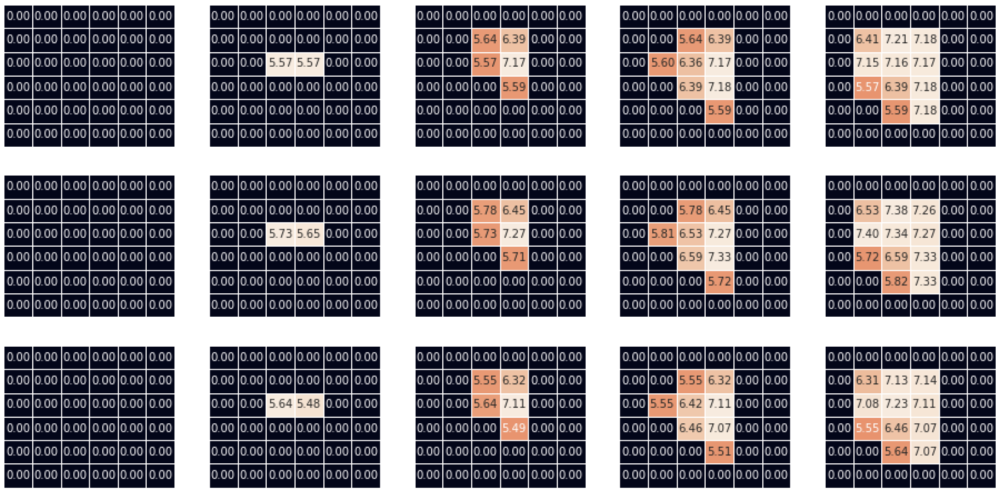

now we perform the pointwise feature competition then call our ```get_k_winners``` function that return our winner ```[(feature_idx=1, row=2, column=2)]```

with that we can call our ```functional_stdp``` function that update the weights accordingly. To make the update more visible we use big learning rate values (**a<sup>+</sup>**=0.4, **a<sup>-</sup>=-0.3**) : 

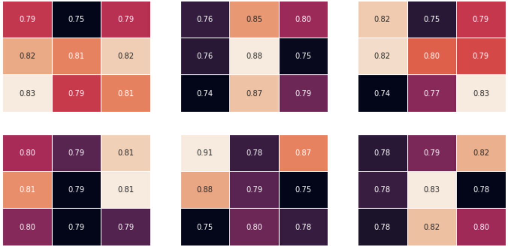

As we see, our winner is one third row, third column. We see that the input spike train emit a spike on the second feature in first timestep at this position and none for the first feature so we confirm that a LTP happen on the second set of weights for the second feature map and a LTD on the first set of weights of the second feature map.

---
Site Map:
* Home Page -> *[Home Page](index.md)*
* Transformer -> *[Transformer](transformer.md)*
* Neural Plasticity -> *[Neural Plasticity](plasticity.md)*
* Automatic Speech Recognition -> *[ASR](asr.md)*
* Spiking Neural Network -> *[SNN](snn.md)*
* Curriculum Vitae -> [CV](cv.md)
* Contact page -> *[Contact](contact.md)*