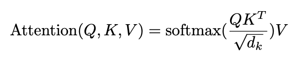
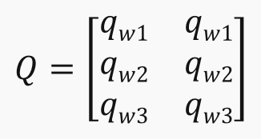
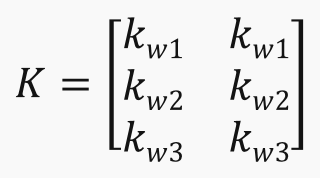
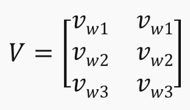
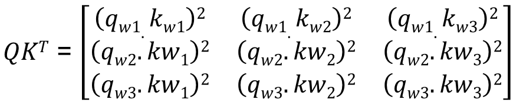
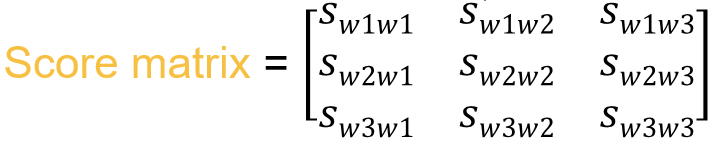
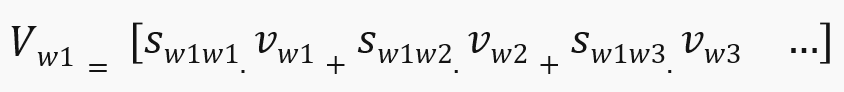

# The Transformer

The Transformer was presented in paper [Attention Is All You Need](https://arxiv.org/abs/1706.03762).

## Scaled Dot-Product Attention

The attention mechanism used is depicted by the following equation:

where Q, K, V and dk are respectively the queries, the keys, the values and the keys dimension.

Proposed formulation of what Q, K, V are:
* Q - query : Input token we currently looking at (a vector)
* K - keys : The tokens we compares to the query (a sequence of vectors)
* V - values : A sequence of vectors used to store the final embedding representation of tokens

The purpose of this attention mechanism is to create, for each token in a sequence, a new contextual representation that enrich token embedding with information of the other tokens in the sequence.

This attention is composed of 3 important steps, let's see them through an example.

We have the following sentence : `my random sentence`

We embeds it into a sequence of vectors : S = [emy, erandom, esentence]

We creates Q, K, V matrices by linearly project each word embedding into embedding of dimension dk for the queries and keys, and dimension dv for the values (for simplicity, we use dk=dv=2).

So we have 3 matrices for queries, keys and values projections : WQ, WK, WV

* SWQ = Q

* SWK = K

* SWV = V

1) First step - Compares each query to each key

2) Second step - Computes a Score matrix by dividing the matrice obtain at step 1 by sqrt(dk) then normalize it (softmax)

3) Last step - Computes our final matrix as the weighted sum of word representation with their attention scores

## Multi-Head Attention
